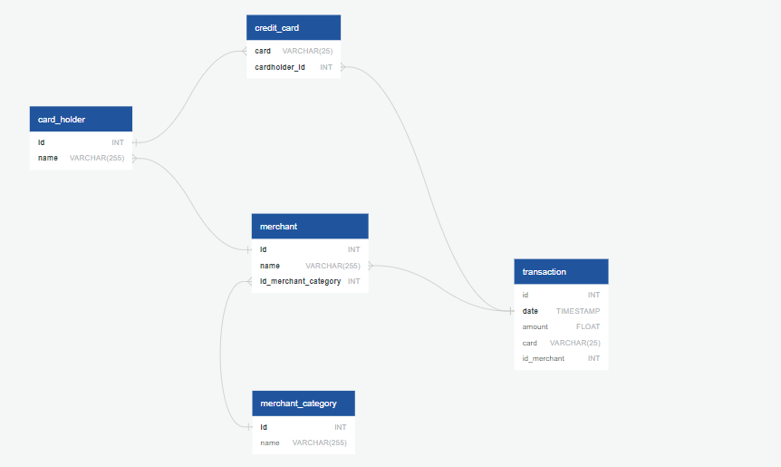

# Fraud Detection Report

ERD below depicts the credit card table's relationship bewteen cradholder table and the transaction table with the cardholder table also connecting merchant table and merchant table connecting to the merchant_category and transaction.

Per the database, transactions less than $2.00, ignored by cardholders roughly amount to 350 transaction which is quite excessive to the point that Megan Price had the highest record of 26 transactions(less than $2.00) with the minimum transactions tied out by Elizabeth Sawyer and Laurie Gibbs. This can be evident that the credit card has been hacked.

The highest transactions made between 7:00am and 9:00am mostly have purchase with extremely high amount recorded - highest amount recorded being $1894. Comparatively, transaction made for the rest of the day recorded extremely high purchase amounts as well. Based on the evidence, we can conclude that this is a somehwat normal transaction executed between these timeframe and that there is no cause for alarm. It is quite safe to assume that business would make these transactions since it is operating in normal business hours. 

Based on research conducted, the top 5 merchants prone to being hacked using small transactions are:

:one: Wood-Ramirez

:two: Hood-Philips

:three: Baker Inc

:four: Jarvis-Turner

:five: Sweeney-Paul

## Cardholder IDs Two(2) & Eighteen (18)

Inferring from the graphical representation, cardholder ID 2 has steady transactional activity which tells us that there is little to no possible fraudulent activity on the card unlike cardholder ID 18 which has sharp strikes every month (one or two activities)- this is an outlier for this card id based on the fact that the card mostly has constant transaction actitives. We can conclude that card 18 is prevalent to fraudulent activity with these spikes and has to be investigated.

## What about cardholder ID 25

Speaking of cardholder ID 25, here are the outliers for the following month:

:January: 1

:February: 0

:March: 1

:April: 3

:May: 1

:June: 3

With the exception of the month of February, all the other months had an abnormal transaction activity with an average of 1.5, with month of April and June recording the highest abnormalities.  
If the cardholder is unaware of these abnormalities, it must be reported for further investigation and resolve.
